# 🌍 Engenharia de Software - UNIVASSOURAS 🖥️


> "Qualquer tecnologia suficientemente avançada é indistinta de magia." - **Arthur C. Clarke**

Bem-vindo ao repositório das aulas de **Laboratório de Programação Back End**! Este espaço é dedicado a todos os alunos que estão empenhados em aprender sobre a magia por trás da interface bonita.

---

## 📚 Conteúdo

Neste repositório, você encontrará:

- 📂 **Códigos-Fonte**: Todos os exemplos práticos das aulas.
- 🧪 **notebooks_nivelamento**: Pasta contendo o nosso nivelamento do conhecimento prévio básico necessário para cursar a disciplina de maneira tranquila.

---

## 🧭 Como Navegar

1. 📖 Comece pela pasta `notebooks_nivelamento` para entender os fundamentos.
2. 🏋️‍♀️ Pratique juntamente com seu grupo definido para aperfeiçoar suas habilidades e criarem seu próprio app.
3. 📌 Veja os projetos dos colegas na seção `Projetos` para inspiração.   **[EM CONSTRUÇÃO]**

---

## 🤔 Dúvidas?

Caso tenha alguma dúvida ou sugestão, sinta-se à vontade para abrir uma `Issue` ou entrar em contato diretamente com o professor.

---

## 🛠️ Ferramentas Utilizadas

- [Visual Studio Code](https://code.visualstudio.com/)
- ... e muitas outras!
---

## 🙌 Contribuição

Este repositório é para fins educativos, mas toda contribuição é bem-vinda! Se você tem algum material ou dica útil que deseja compartilhar, fique à vontade para abrir um `Pull Request`.

---

## 🎓 Autor

Prof. Me. [Caio Jannuzzi](https://www.linkedin.com/in/caiojannuzzi/)
<br>

> "A educação é a arma mais poderosa que você pode usar para mudar o mundo." - **Nelson Mandela**
> 
[](https://doi.org/10.5281/zenodo.10667208)

---

⭐️ Lembre-se de dar uma estrela neste repositório se ele te ajudou!

---

---


Neste README.MD que estará em constante atualização, acompanharemos o desenvolvimento de um app para gestão de carros!

**Objetivo da disciplina é o aluno juntamente com seu grupo, ao final do semestre apresentar um app totalmente funcional (CRUD).**

## Ambientação e instalação

<strong> Instruções - windows</strong> <br>

Instalar o python em <https://www.python.org/>
Instalando pelo site, a ferramenta ja com vem o PIP e o VENV instalados nativamente.
podemos sempre verificar a versão atual do PIP com:

```pip --version```

e atualizar o PIP com:

```python.exe -m pip install --upgrade pip```

Observação: No Linux, deve-se instalar essas ferramentas

Voltando ao Windows...
Para criar o ambiente de desenvolvimento VENV para que não corramos o risco de alterar o python nativo instalado no windows, devemos...

1. criar o ambiente de densenvolvimento.
Para criar devemos ir (de preferencia) na raiz da pasta onde concentraremos nosso projeto.
código:

```python -m venv venv```

note que o último venv é referente ao nome que damos ao ambiente de desenvolvimento..fica livre a escolha do mesmo porém se adota venv como padrão.

2. Ativando o ambiente de densenvolvimento no windows.

```venv/scripts/activate```

2. Ativando o ambiente de densenvolvimento no Linux.

```source venv/bin/activate```

Ao ser ativado o terminal ficaria com um (nome verde) e passara a usar tds as dependencias dentro do python do ambiente recem criado

Podemos inclusive verificar a versao do PIP instalado neste python do venv e atualiza-lo.

```pip --version```

```python.exe -m pip install --upgrade pip```

### Política de execução Powershell [Windows]

Um ponto importante para quem esta rodando no Windows, devemos alterar uma configuração do PowerShell para rodar ele de boa no VSCode.
Usando o PowerShell temos maior controle sobre nosso PC e por padrão ele vem com algumas restrições de execução de scripts no PC, enfim, temos que corrigir isso. E sera da seguinte forma.
Devemos abrir no PowerShell com privilégios de administrador e rodar algum desses comando a seguir. <strong> RECOMENDO O 1 </strong> pois é geral mas vai depender da maneira como voce usa o PC onde esta executando este curso.

1. Alteração de política global:

```Set-ExecutionPolicy Unrestricted```

ou

2. Alteração de política por sessão:

```Set-ExecutionPolicy -ExecutionPolicy RemoteSigned -Scope CurrentUser```

A ideia é sempre que pegar um windows zerado logo executar esse comando para evitar dores de cabeça futuras.

# Começando pelo COMEÇO

Conhecimento básicos que devemos saber para iniciar no python
ver os notebooks

Começando com Django.

1. Criando e Conhecendo o seu Projeto

Mas qual é a ideia do projeto? Guardar registro de carros! Marca, modelo, ano e etc. 
<br> 
É uma app simples e funcional!

1. Crie uma pasta com o nome do app;

<br>
2. Crie um ambiente virtual venv dentro da pasta;

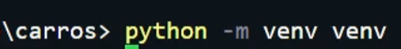
<br>
3. Ative o ambiente criado


<br>
Para verificar se ativou... no seu terminal irá aparecer a imagem a seguir

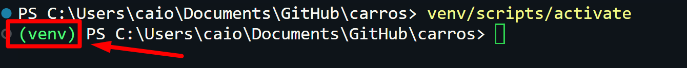
<br>

4. No terminal `pip install django`
Para verificar se o django foi instalado na versão correta rode o  `django-admin --version` no terminal
O retorno deve ser a versão instalada.
<br>

Até o momento temos:
* ambiente virtual criado e ativado
* django instalado e verificado

5. Quando instalamos o Django, ele cria alguns comando no CLI do django-admin para que possamos gerenciar nosso projeto

O primeiro comando que podemos utilizar é... `django-admin startproject` + nome do app + .
<br>

O ponto é para indicar ao django em qual diretório vc quer q ele crie os arquivos iniciais do projeto e como já estamos na pasta carros pelo terminal.. o ponto indica ela.

Então.. fica assim "django inicie o projeto de nome app na pasta raiz em que estou localizado"
Por que app? Ela é o coração do projeto..se eu chamasse de carros seria ./carros/carros/ arquivos do django então poderia ficar confuso. Por questão de organização escolhi esse nome.
<br>

Ficando, no terminal: `django-admin startproject app .`
<br>

6. Perceberam que ao dar o startproject o djando criou o arquivo `manage.py`?

Este arquivo chama uma série de comandos internos para rodar nossa aplicação django. 

O próximo comando no terminal é :  `python manage.py runserver`

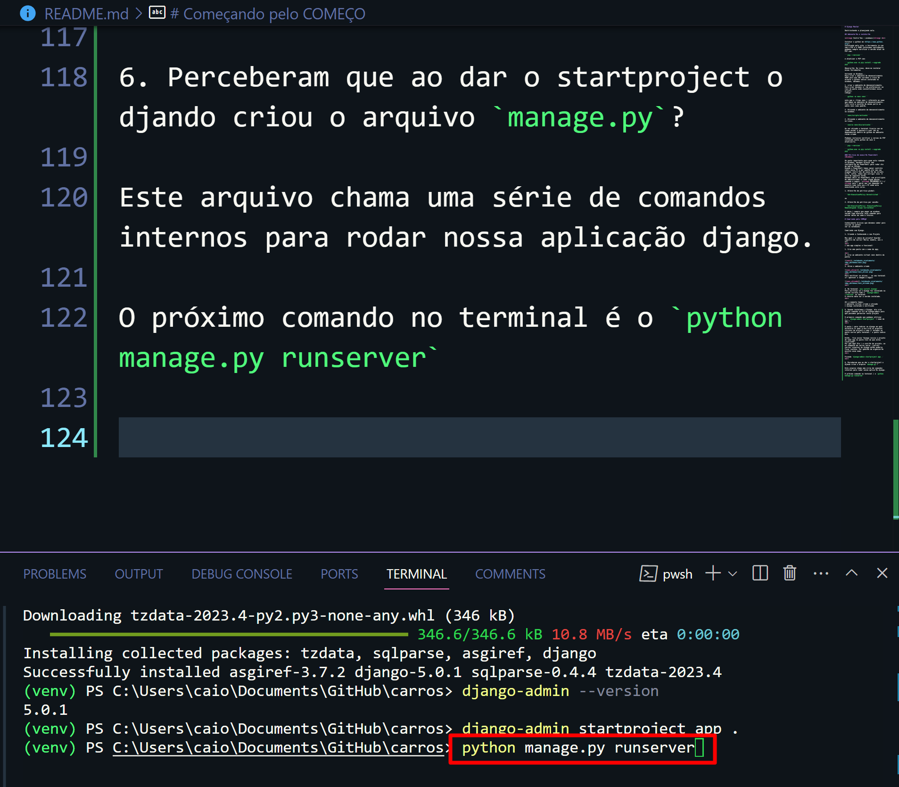

No terminal haverá a seguinte mensagem

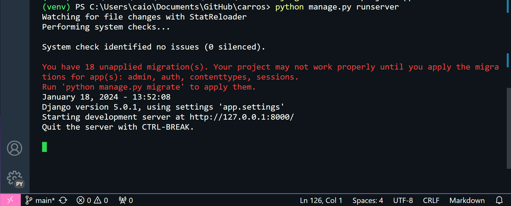

E ao clicarmos no `http://127.0.0.1:8000/`
Seremos direcionados ao navegador e se tudo deu certo e o servidor startou..


A imagem acima é como se fosse um Hello world do django rs

DETALHE: PARA DESLIGAR O SERVIDOR QUE SUBIU É SÓ APERTAR <strong>CTRL+C</strong>

7. Dando uma pincelada sobre TESTES bem rapidamente.
É de conhecimento comum que códigos que possuem testes são melhores vistos.

Mas como testar no django? Simples, podemos botar para rodar nossos testes da seguinte forma, no terminal:
`.\manage.py test`

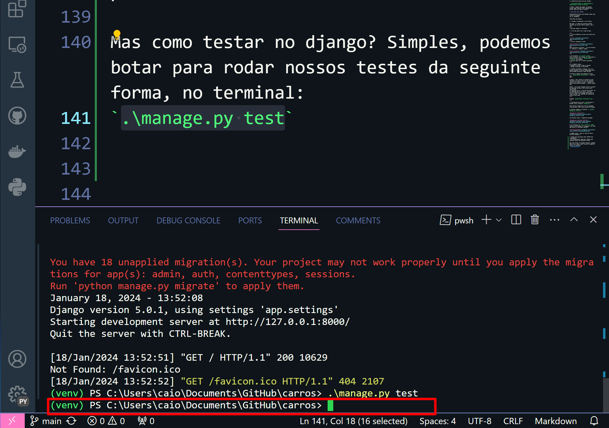

Note que não retornou nenhum resultado pois não temos ainda nada configurado a respeito, porém foi feita a rotina de execução do próprio django.

Temos uma outra forma mais visual de ver isso também pelo terminal:
`python manage.py test`

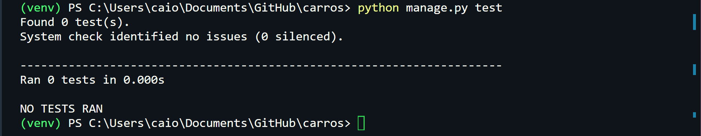

8. Django apps
Durante o andamento do nosso projeto carros teremos vários apps (não considera a app criada inicialmente pois ela é a pasta principal de configurações.. o coração do nosso projeto) e isso é uma grande vantagem do django. 

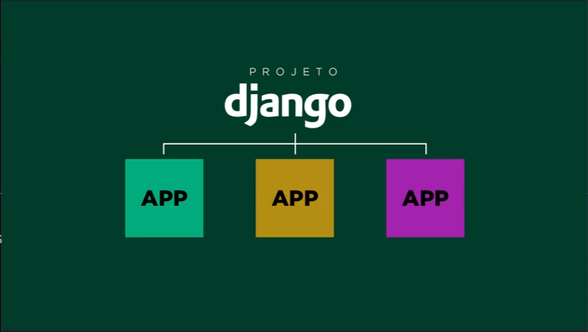

Queremos fazer um gerenciamento de carros...e vamos criar uma aplicação dentro do nosso projeto e dentro dele (o verde por exemplo) haverá toda a lógica de registro de carros, podemos também ter um app sobre vendedores de carros (amarelo por exemplo). Poderiamos colocar toda a nossa app dentro de um único projeto tudo misturado... poderiamos sim mas não seria uma prática. O ideial é todo app ter sua separação lógica e organizada e isso facilita muito na manutenção do código em sí.
<br>

9. Criaremos agora nossa primeira app do django que sera nossa princial para gerenciar o cadastro de carros.
<br>

No terminal: `python manage.py startapp cars`

Note que uma nova pasta agora aparece na raiz na pasta carros

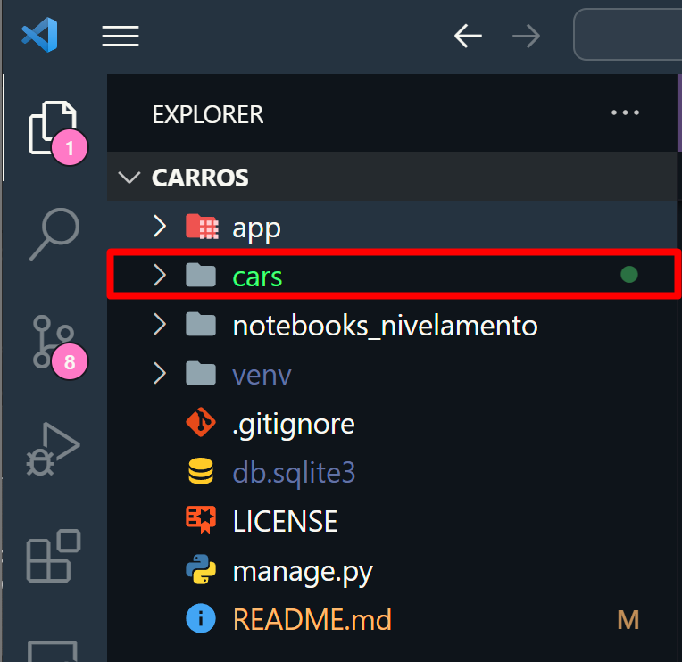

<strong>Informação importante</strong>

Criamos a pasta app cars porém ainda não estamos dizendo ao django para a usarmos. 
Devemos resolver isso no coração do nosso projeto... no app> arquivo <strong> settings.py</strong> que é nosso arquivo de configuração geral de projeto

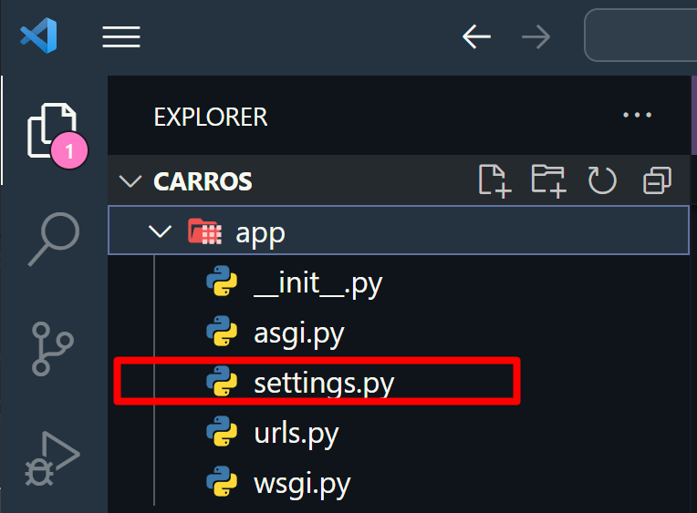

Por padrão, temos de fábrica os seguintes itens já pré configurados

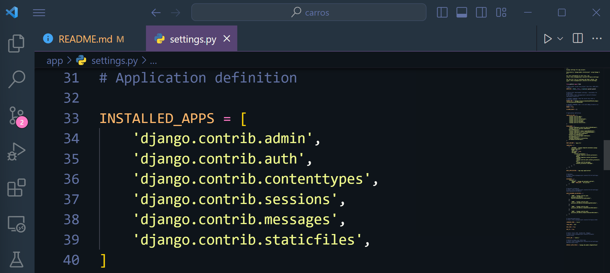

Devemos adicionar o app cars no settings.py nos INSTALLED_APPS

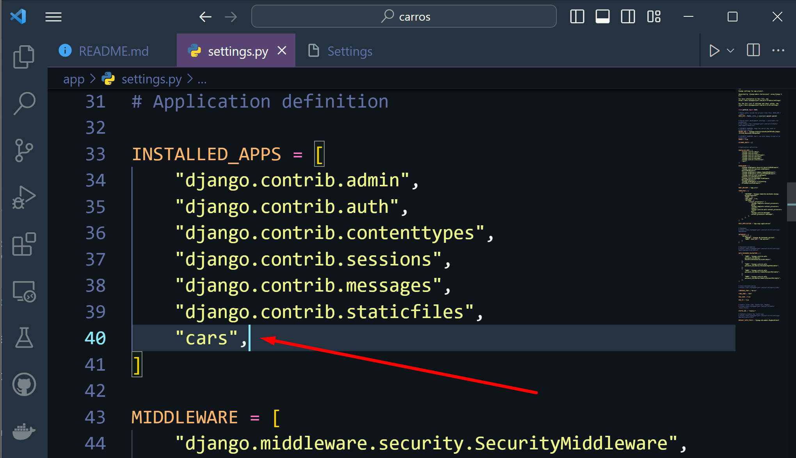

Feito isso, agora podemos explorar melhor nossos arquivos da nossa nova app.

Um arquivo muito importante é o models.py
Em toda app que a gente criar nos vamos ter q utilizar esse arquivo pois é nele que iremos escrever nossos models ou modelos, ou fazendo uma analogia melhor... as nossas tabelas do banco de dados.

É neste models.py que sera dito que a tabela carros terá o campo nome do carro, o campo ano do carro, o campo modelo do carro e que esses campos serão charfields de 100 caracteres ou que esses campos serão do tipo inteiro.

Os models do django tem camada própria e é importante dominar isso.

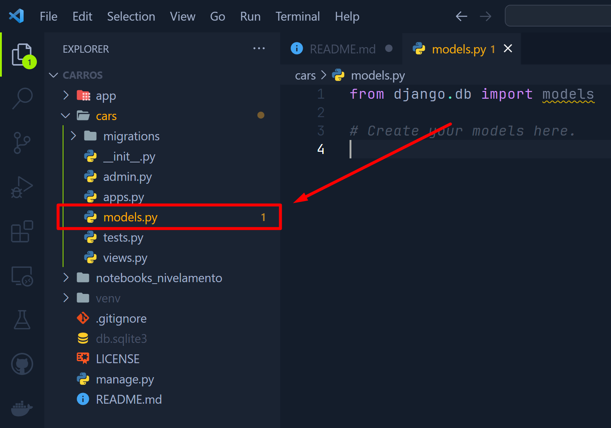

Teremos mais a frente uma app vendedores de carro e nesta app também haverá um arquivo models.py e por ai vai.

Temos também outro arquivo importante que é o views.py

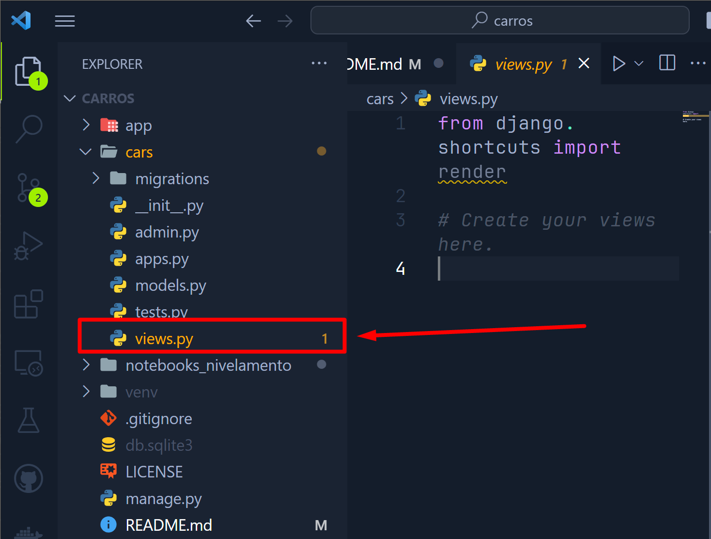

Neste arquivo iremos escrever todas as views do nosso app cars.

Basicamente a view tem a lógica que precisaremos aplicar a nossa aplicação como por exemplo quando um usuário bater no link /carros e quiser listar os carros na página de carros. Será lógica de trazer e renderizar que esta página estará nas views.py

Temos também o arquivo admin.py

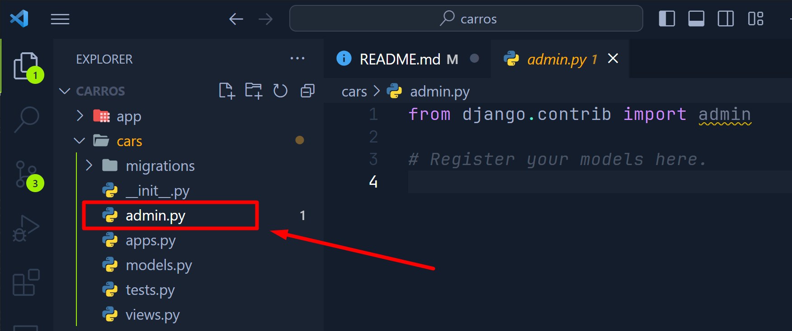

O arquivo admin tem relaçao com a admin do django. É uma tela de adminstração de conteúdo. Não são vistas pelos clientes finais de quem acessa o site, são vistas apenas pelos administradores do sistema. Através do admin conseguimos um CRUD completo de cars.

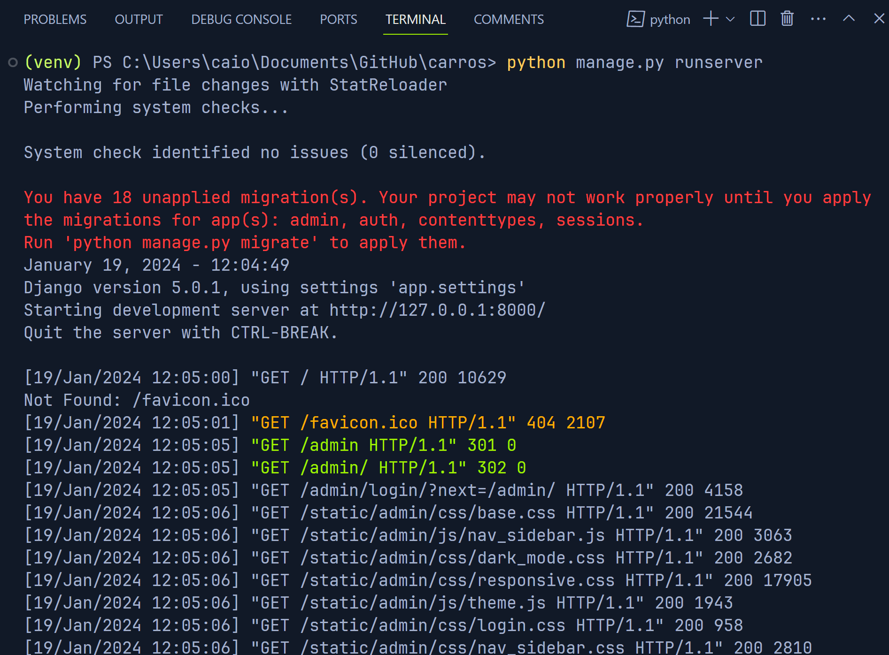
r
Subindo o servidor e através do /admin temos a tela admin.
V
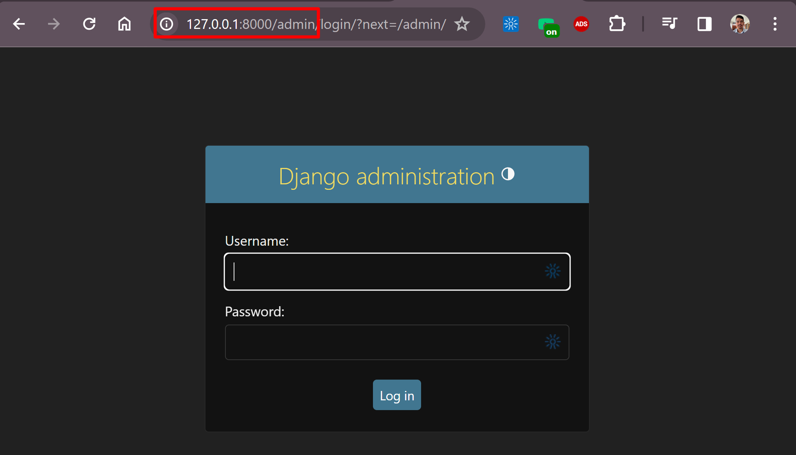

O usuário e senha veremos mais para frente.

Contudo, de onde vem esse /admin?

Láaa no nosso core do projeto (app), temos o urls.py e dentro desse arquivo temos permitida a rendização do admin/

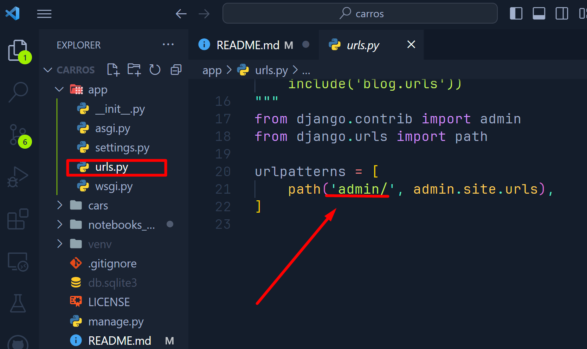

10. Entendendo Apps e Camadas no Django

Vamos falar um pouco sobre as camadas do django.

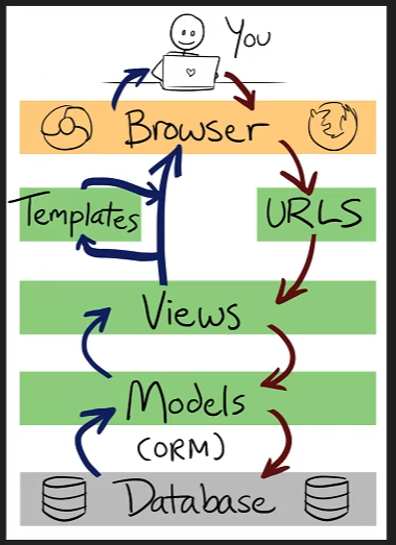

Temos o nosso usuário usando o navegador, usando o nosso sistema que esta rodando no servidor

Ele vai bater em alguma URL, então a nossa primeira camada é o URLS. É o roteamente de urls que o django faz essa interpretação.
Portando, por exemplo, quando usuário bate na url /admin ele vai no arquivo de urls.py do core do projeto (app) e olha o tipo de urls acessada e qual o direcionamento que deve acontecer.

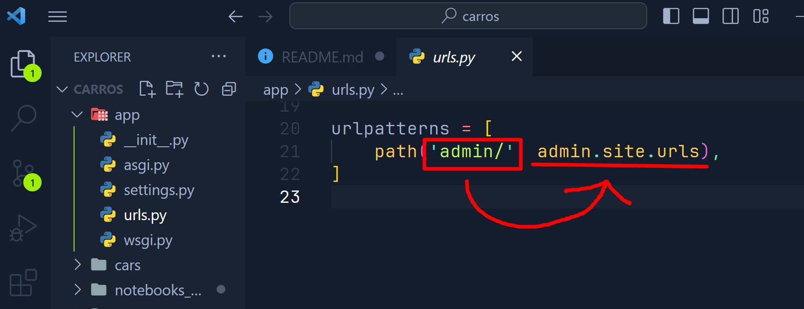

Logo, podemos entender que esse urls leva para uma página de admin que é uma view.

Dentro do arquivo de views no core do projeto (app) estará o comando para retornar cars. Ela fará um trabalho de meio campo de trazer dados e retornar para o usuário.

E como a views faria isso? Conversado com os Models, que é outra camada.

A views vai buscar nos modals informações como por exemplo nome do carro, ano do carro e tudo mais. Nesse processo os models conversam com os bancos de dados e os bancos de dados retornam os dados para os models e os moderls por sua vez disponibilizam para as views. A view por sua vez devolve para o navegador do usuário a página de carros com os dados que ele solicitou.

Pode parecer confuso agora porém veremos camada a camada mais a frente.

11. Comando `makemigrations`

Usaremos com certa frequencia no django.

Esse comando é o `makemigrations`

No terminal: `python manage.py makemigrations`

Mas o que o `makemigrations` faz?
Ele varre o projeto inteiro, no sentido de dar uma geral e não no sentido de excluir! O django olha app por app, camada por camada, modelo por modelo e monta os migrations que são arquivos de código python (neste contexto) que tem escritos neles comandos para o banco de dados! 
Por exemplo, dentro de um arquivo migrations pode ter um comando de create table no banco de dados (um comando django para o BD para criação de tabela) e esse comando pode dizer assim: rode esse comando aqui e criar uma tabela no banco de dados com o nome cars.

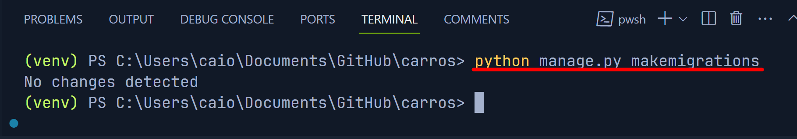

Na imagem acima, rodamos o migrations porém não houve alteração alguma pois ainda não criamos nada em cars

Porém, notem que dentro da app cars criou uma pasta com um __ init __ com o nome de migration e se houve algo para ser colocado nela seria ali o local.


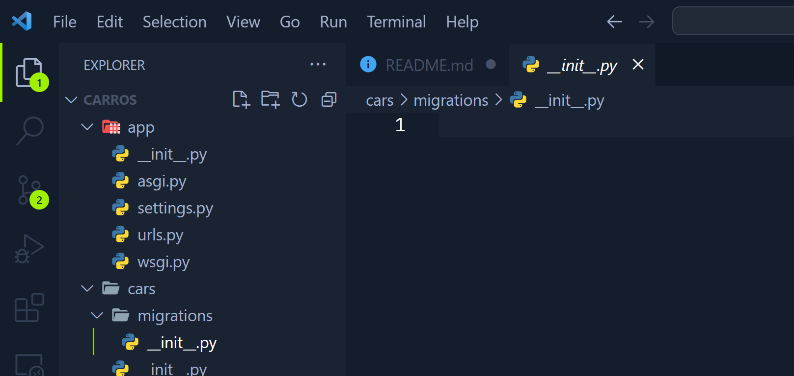

12. Comando `migrate`

O comando migrate já um comando que vai executar as migrations.

No terminal: `python manage.py migrate`

Mas oque que o migrate realmente faz?
Ele faz o Django varrer todas as pastas de migrations dentro das nossas apps e de fato vai criar esse script de banco de dados e executar dentro do banco de dados criando toda a nossa estrutura.
Mesmo não havendo nenhuma estrutra montada pela gente, o django em sí já tem as próprias estruturas que precisa criar.
Vamos rodar o migrate para ver o tanto de coisas que o django vai fazer.

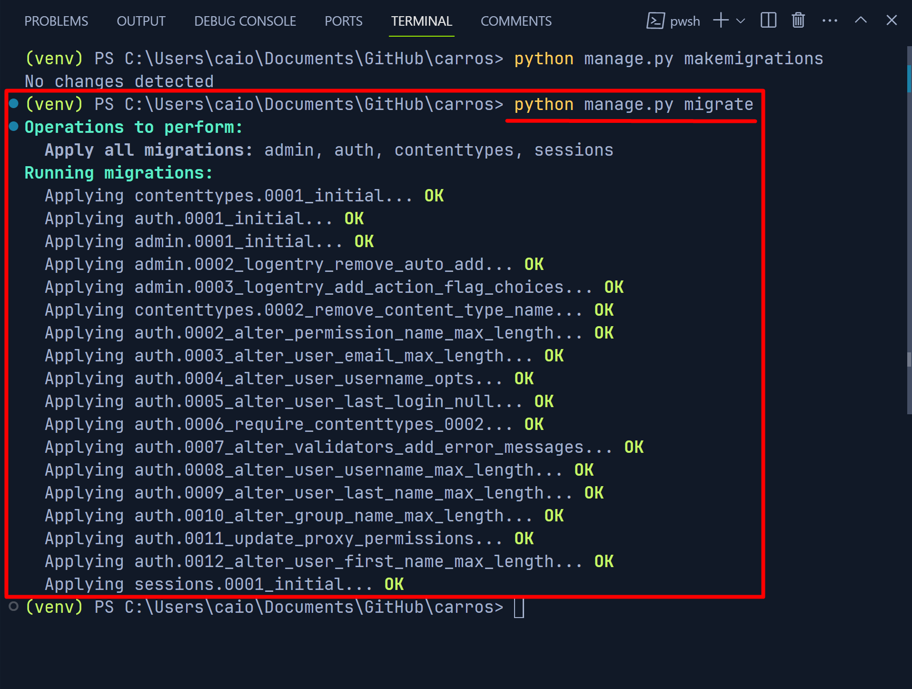

Executou várias migrations de criação de tabela de usuário, validação... coisas internas que o django precisa para trabalhar

#### Importante!

<strong> Sempre que houver uma alteraçãos em nossos models, nossas tabelas do banco de dados, enfim, sempre que alterarmos alguma coisa... para passarmos essas alterações precisamos: 

1. Rodar, no terminal: `python manage.py makemigrations`
Para criar o script de banco de dados

2. Rodar, no terminal: `python manage.py migrate`
Para pegar o script gerado e executar no banco de dados criando tudo que precisa. </strong>

Para visualizarmos nosso banco de dados sqlite, vamos usar a extensão SQLite Viewer (https://marketplace.visualstudio.com/items?itemName=qwtel.sqlite-viewer)

Com a extensão instalada temos a seguinte visualização

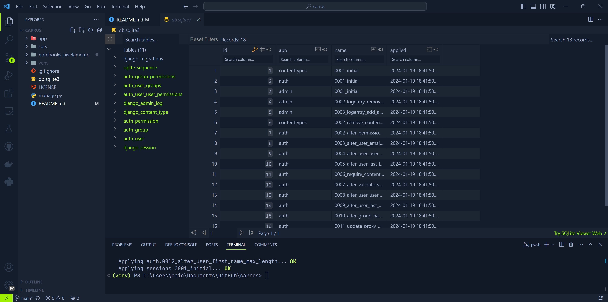

Observe que eles criou as 11 tabelas com o comando migrate.

Sera na tabela auth_user que cadastraremos nossos usurários ... inclusive superusuários

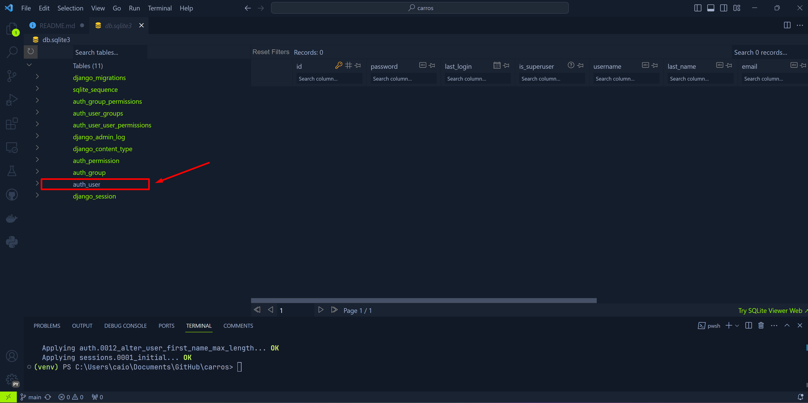

Temos alguns campos nessa tabela conforme imagem a a seguir.


Note na imagem acima que temos inclusive já alguns campos que perguntam se ele é superusuário ou não

Enfim, o banco de dados já esta inicializado com a estrutura básica que precisamos para começar.

13. Acessando o Admin do Django

A tabela de user esta criada, porém vazia. Vamos resolver isso!

No terminal:  `python manage.py createsuperuser`

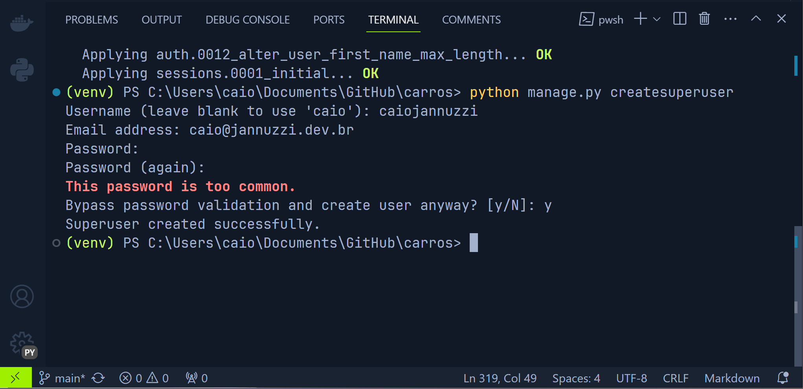

Destaque para <strong> This password is too common </strong> kkkk

De qualquer forma o superusuario esta criado kkk e podemo ver na tabela auth_user
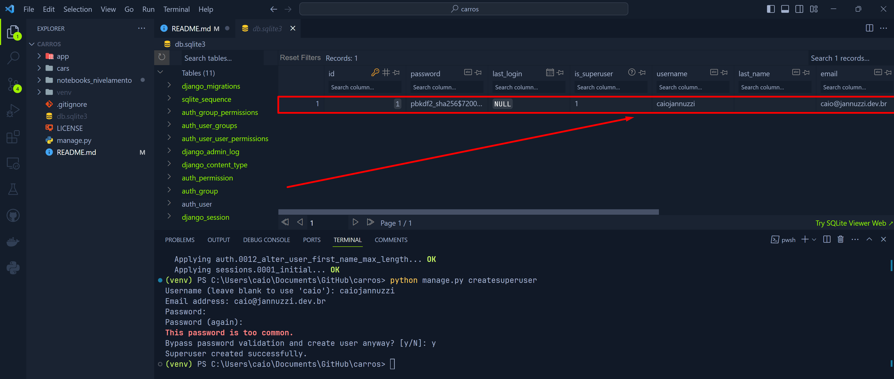

Curiosidade!!! O django já vem com um sistema de encriptação de senhas no banco de dados! Muita coisa pronta né?!

Na teoria... com nosso superusuário criado já conseguimos acessar o admin do django. Vamos testar!

No terminal: `python manage.py runserver  ` 
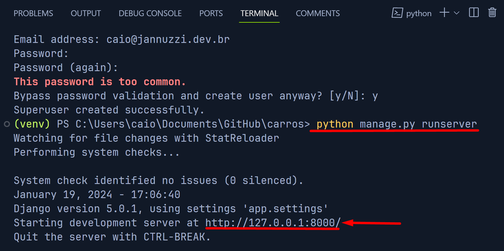

A imagem a seguir mostra que o server subiu na porta 8000.
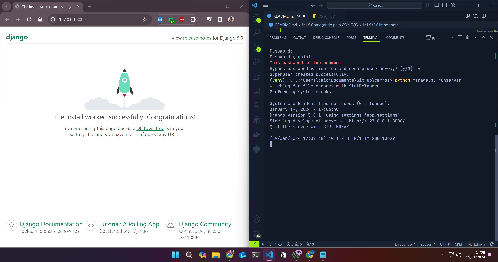

Vamos à tela de admin do django.
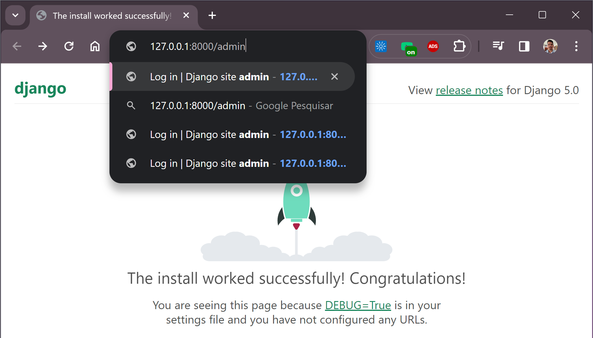


Ao logarmos com o usuário criado como superusuário temos a tela a seguir.
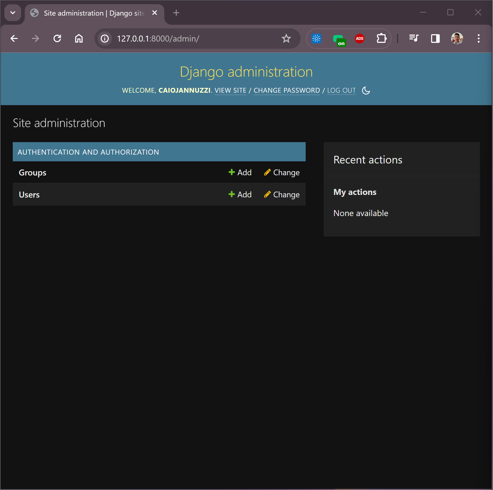

Nossa aplicação esta quase "zerada", só temos os itens defaults que é um administrador de grupos e um administrador de usuários. Olhe que nosso usuário (e únicio até então) criado já consta lá. Vamos clicar em Users e tirar a prova real.
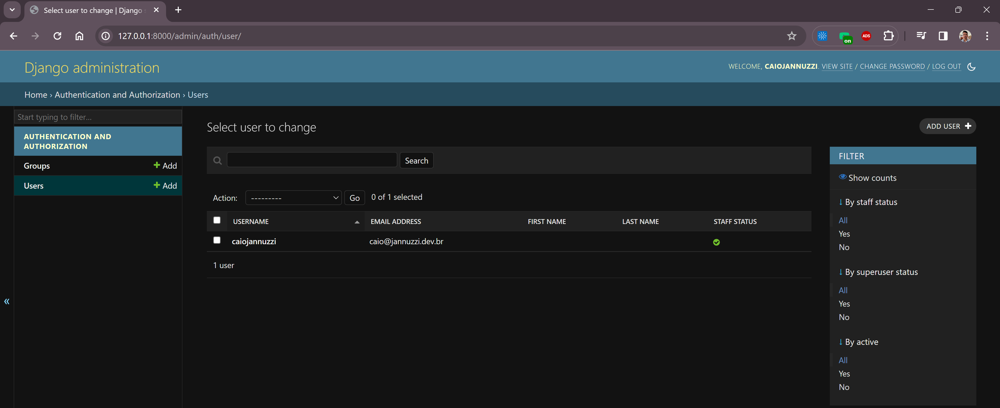

## Django e Banco de Dados (model e admin)

#####  14. Criando nosso primeiro modelo (Car)

Neste parte iremos começar a desenvolver o modelo de carros...criar a tabela de dados para gerenciar os registros de carros.

Bora para o models.py do app cars.

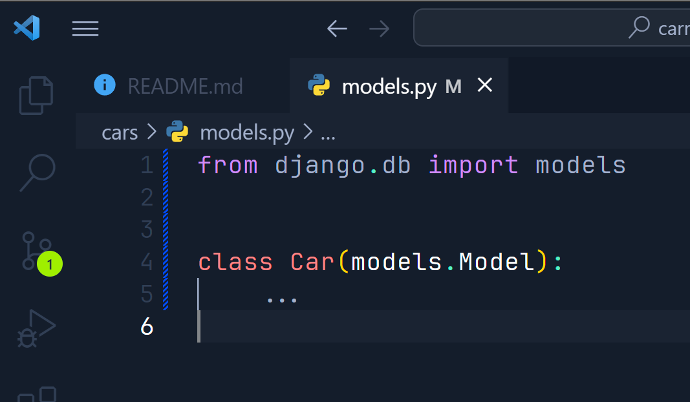

Criamos a classe chamada Car. O nome da classe vai ser o nome da tabela no banco de dados. Car Será o objeto que vai que tomar conta disso.

A classe criada Car tem uma herança... ela vai herdar da classe  Model que já esta pronta no Django. Estamos indicando para o Django que a classe Car será um modelo.
Precisamos agora escrever os campos que a nossa tabela vai ter.

O primeiro campo sera o <strong>id</strong>.

Quando declaramos que nosso <strong>id</strong> será um <strong>autofield</strong> e ele vai ser a <strong>chave primária</strong> da nossa tabela do banco de dados eu estou usando o autofiled que é uma função já existente no Django e depois quando migrarmos para nosso banco de dados ele vai criar um campo lá se auto incrementando, ou seja... se cadastramos nosso primeiro carro ele tera o id = 1, nosso segundo carro id=2 e por ai vai de forma <strong> automática </strong>

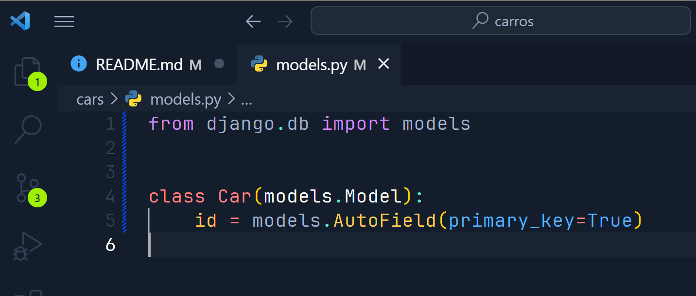

Bora para próxima

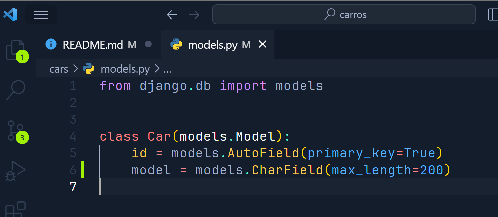

O campo model (l.6) não tem nada a ver com a classe Model.. ele é so o nome de um campo da minha tabela. O campo será um <strong>CharField()<strong> que é o tipo texto.. que aceita todo tipo de caractere.
IntegerField() indica que o campo vai aceitar um número inteiro.
FloatField() indica que o campo vai aceitar um número co vírgula.

 parametros:
 max_length=200 indica que o número máximo de caracteres são 200.
 blank=True indica que ao cadastrar um novo carro no sistema esse campo de ser deixado em branco... não informar nada neste campo
 null = True indica que ao cadastrar um novo carro no sistema esse campo de ser deixado nulo... não informar nada neste campo

 É interessante que criemos o hábito de inserar variáveis em ingles por padrão.

Feito isso temos a tabela básica feita!

#####  15. Criando tabela no Banco de Dados

Criamos uma tabela de carros anteriormente mas como faço o Django entender que isso é uma tabela de carros e que serão armazenados dados de carros nela aplicando no banco de dados?

Precisamos voltar naqueeela didática imagem.


Estamos neste momento, na imagem, estamos na camada Models. Um model nao se comunica diretamente com o banco de dados... existe uma API chamada <strong>ORM</strong> que faz que esse intermédio. O Django já vem com esse ORM proprietário dele chamado <strong>Django ORM</strong> que é a API responsável por ser comunicar com o BD... pegando o models.py traduzir e executar as configurações no BD. Essa via é de mão dupla..ele pode fazer o caminho inverso também por exemplo levando informações no BD e trazendo para nossa View e entregar para o usuário a lista de carros.

Vamos rodar um comando para dizer ao django para migrar a tabela e escrever no BD. Os comandos são nosso conhecidos `makemigrations` e `migrate`.

No terminal: `python manage.py makemigrations` para gerar um script com instruções para nosso BD

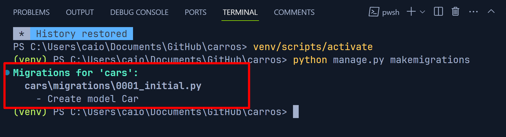


No terminal: `python manage.py migrate` para varrer a aplicação e atraves da ORM do django traduzir para um script SQL e executar o(s) script(s) migrations criado(s).

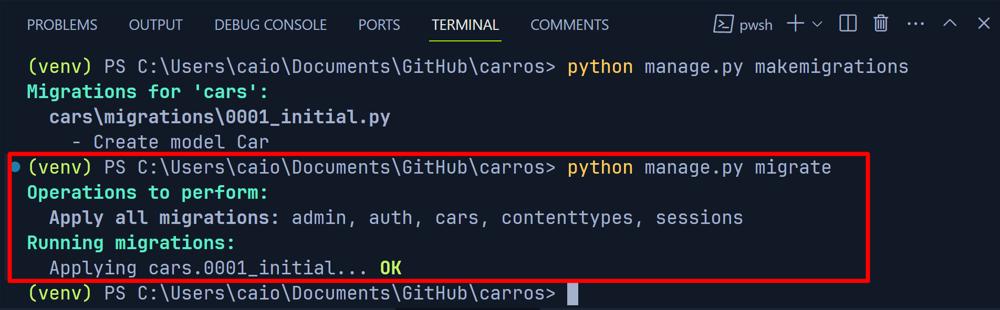

Podemos conferir agora se a tabela foi criada.

O Django tem um método para nomear a tabela que segue nome_da_aplicacao_+_nome_da_tabela (cars_car)

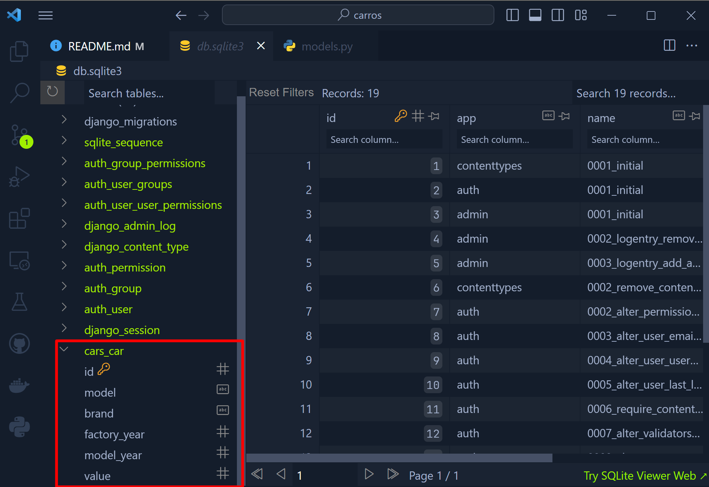

#####  16. Configurando o Admin do nosso model (Car)

Vamos agora cadastrar carros em nosso sistema já que temos nossa tabela criada.

A ideia é fazer o administrador do sistema através do django-admin acessar o sistema para ter disponível o cadastramento de carros.. inserir no banco de dados.

Bora rodar nosso servidor para ver como estamos. 

No terminal:  `python manage.py runserver`

Note que ela ainda não aparece no django admin pois não demos nenhum comando para a tabela aparecer no painel de admin. Para fazer isso devemos trabalhar no admin.py do cars. Precisamos registar nossos modelos lá para podermos usar.


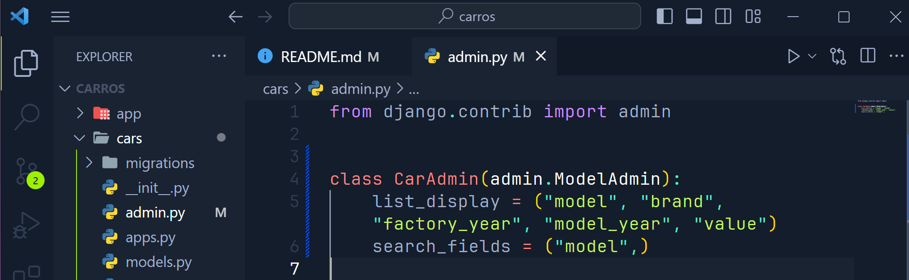

<strong>list_display</strong> diz quais campos queremos que apareçam na nossa grid
<strong>search_fields</strong> diz qual campo é pesquisável

Ja configurado o admin do carro, porém ainda não registramos esse admin criado.

Vamos resolver isso...

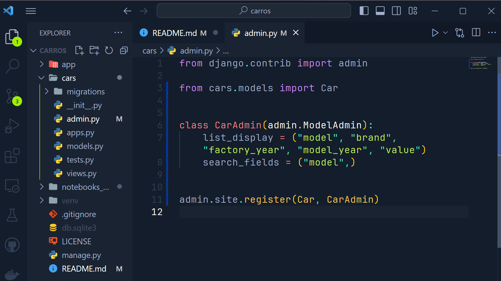

O admin.site.register(parametro 1, parametro 2) pede 2 parametros, sendo o primeiro o modelo (tabela no BD) e o segundo as configurações de admin que queremos para este modelo. 

Ao entrarmos no /admin o cars já estara disponivel para cadastro e pesquisa (modelos de carro).

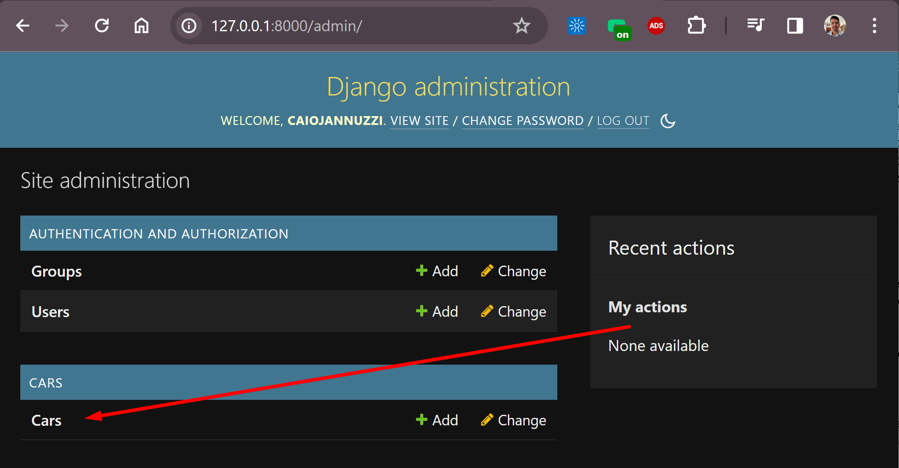

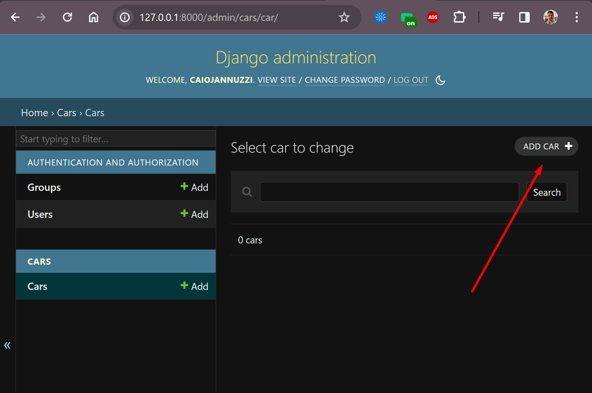

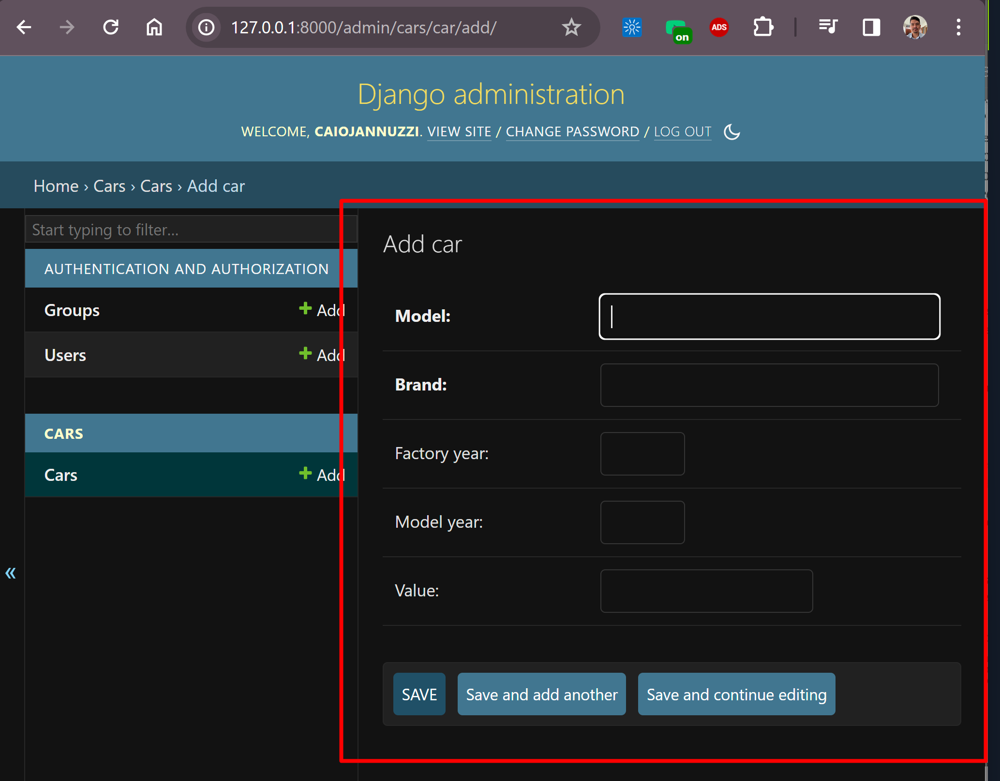


#####  17. Configurações adicionais do nosso projeto
Bora subir nosso servidor local 
```python manage.py runserver```
Entrem no django-admin dele
```http://127.0.0.1:8000/admin/```

Vemos que anteriormente já configuramos no administração de carros (cars) e ele já aparece em nosso painel de administrador do sistema o modelo de carros para começarmos a inserir os modelos de carros. Vamos a seguir ver algumas configurações para deixar mais usual.

Entremos em Cars
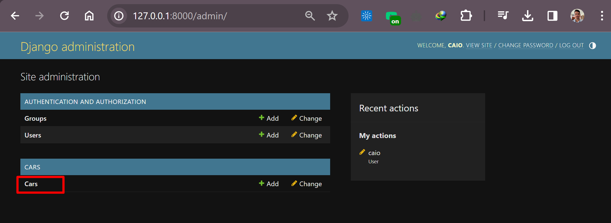

E temos outro painel

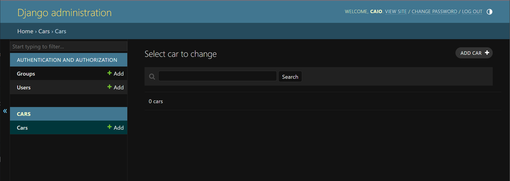

Bora adicionar!
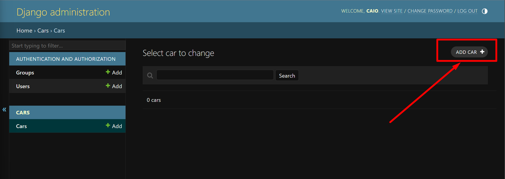

Primeiro carro a ser cadastrado é nosso Marea

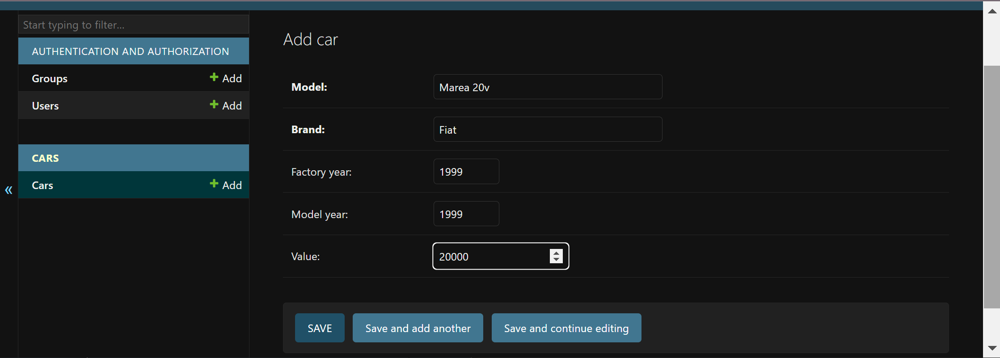

Cadastrado!
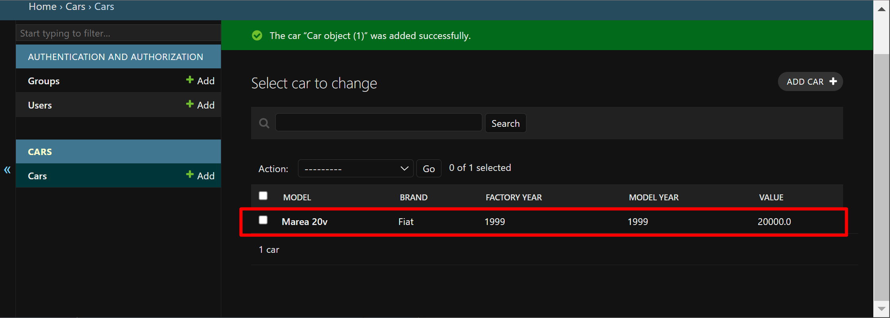

Reparem que os campos são MODEL, BRAND, FACTORY YEAR e VALUE. Esses são os campos que sinalizamos em nosso admin.py que deveriam ter 

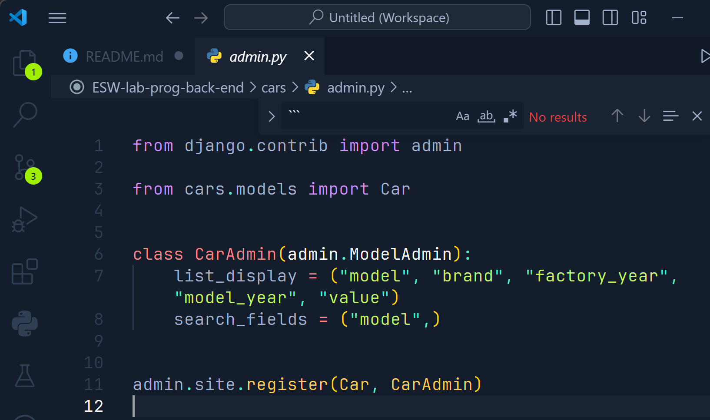

Caso queiramos por algum motivo deletar o campo VALUE, é só ir no admin.py e deletar por lá, salvar e atualizar a página web do django-admin que o VALUE some.

Em resumo: 
list_display = são os campos que queremos que apareçam.
search_fields = são os campos onde podem ser pesquisados

Adicionemos outros carros para demonstrar esse search_fields.

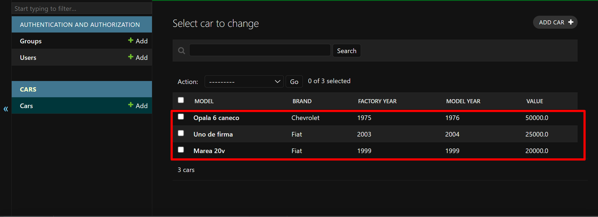

Agora podemos usar o campo de buscar.
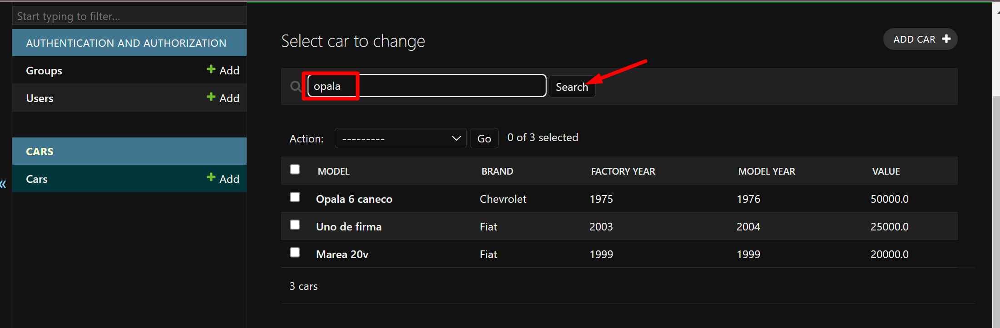

Buscamos o Opala como exemplo.


Explicado a questão da busca apenas no campo Model.
Caso queiramos que ele também busque por fabricante, devemos adicionar BRAND ao campo search_fields.

Gostei a ideia...vamos adicionar também!


Salve e atualize a página.


Deu certo!

Próximo passo...

Reparam que nosso painel de admin esta todo em inglês?
Zero problema mas se tu preferir em português, devemos configurar nosso django para operar em porguês.
Bora desenrolar isso!

Bora para nosso "core <3" rsrs. Nossa pasta app é o coração do nosso projeto. Dentro dessa pasta temos o settings.py e nele é só mudar a língua para pt-BR.


Salve e atualize a página.


"aahin Caio mas não traduziu o Cars, Model, Brand, Factory, Model Year e nem o Value"

-- Calma ae paizão, a modificação feita nem tocou nela pois foram campos "codados"

Ja que estamos abrasileirando a parada, por qual motivo não mudamos também o TIME_ZONE?

Bora mudar!


Feito! 

Bora para uma próxima configuração aew.

Dentro do nosso models.py da nossa pasta cars temos 


Vamos criar um função __ str __(self) que retorna o self.model
Ok, mas que bruxaria é essa?
A função "dunder str" é uma função padrão de model e ela quando não criada mostraria nossos models de uma maneira feia e sequencial. Ao arbtitrarmos para sobrescrever no nosso modelo deste jeito, definimos que ela tem que retorne o nome do modelo do carro.

Ok, disse disse e não manjei mesmo assim.
Bora pro visual...
Vou comentar a função criada para que vejamos como seria sem ela.


Comentada!


Viram? Ela vai simplesmente de forma sequenciada feiona.

Agora bora descomentar a função criada e ver como que vai ficar.

Agora que vi que no código digitei errado rsrs, lancei __ srt __ quando deveria ter lançado __ str __. Enfim, corrido!


Vejamos a alteração na visualização ao atualizar a página.


Essa jogada da função não serve tão somente para deixar bonitinho não. Mais para frente na ORM do Django quando formos buscar dados essa jogada será muito útil.

##### 18. Criando modelo e admin de marcas (ForeignKey)

Vamos agora explorar um conceito de tabelas, ligação de dados e chave estrangeira.

Bora subir nosso servidor local 
```python manage.py runserver```
Entrem no django-admin dele
```http://127.0.0.1:8000/admin/```

E se pudessmos preparar uma lista de fabricantes de carros que aparece para admin quando ele vai cadastrar um novo veículo? Seria maneiro né? Bora!

Mas primeiro, bora <str>deletar todos os carros</str> já criados em nossa tabela.


Confirme e já era.


Para que façamos a alteração que iremos desenrolar agora, precisamos que a tabela esteja vazia.

Vamos melhorar nossa tela de administrador!

Bora para o models.py em cars.


Vamos criar um cadastro de marcas para que consigamos cadastrar a marca e depois usar a marca quando formos cadastrar um carro. E isto é uma ligação de chave estrangeira entre tabelas!

Hoje nosso campo Brand é muito livre, se quisermos lançar uma marca maluca que não existe ele vai aceitar e é isso, não é muito legal essa liberdade toda. 

Precismos criar uma nova tabela e linkar os dois para que haja uma validação. 

Na nova tabela a ser criada, haverá uma maneira de selecionar os dados que serão ligadas por chaves ao nosso campo Brand de Car.

Se liguem na pintura rupestre de ilustração.


1 para 1 será a relação, um registro de marca de carro estará ligado a uma marca no banco de dados.

Enfim, nosso campos Brand agora terá que ter um registro específico e não mais um texto livre.

Para viabilizar essa ideia, bora criar um modelo novo (class Brand) no nosso models.py da cars.


Nesse modelo teremos o id que será único para cada registro e também o nome de cada marca.

Agora no modelo de Car, devemos modificar o campo brand né para não dar problema pois no momento ele está do tipo texto e mudaremos para o tipo ForeignKey


"Mas Caaio, oqq rolou?"
-- Calma lá paizão, bora desenrolar isso ai.
O django trás essa "função" ForeignKey pronta que basicamente diz "mermão esse campo aqui terá ligação com outra tabela!" e tabela que em que vai rolar essa ligação é o primeiro parametro que se coloca (que no caso foi o Brand). 
On_delete no models PROTECT quer dizer que os carros estao protegidos de uma possível tentativa de deletar a marca em que estao cadastrados. 
Por exemplo, imagine que temos 1000 carros cadastrados da marca Fiat..e do nada me da a doidera de querer excluir a marca Fiat. O que aconteceria? Há uma dependencia envolvida, esse protect protege para que os 1000 caros não sejam deletados nesse impulso, havera um impedimento em função da relação existente. Uma curiosidade é que ao invés de PROTECT eu usasse um CASCADE..ao deletar a marca todos os 1000 carros cadastrados com essa marca iriam de arrasta para cima.
Related_name é somente como gostariamos de chamar essa relação...pode colocar qualquer coisa desde que entendam que há uma relação ali.

Lembram do __ str __ que dizemos no Car?
Devermos fazer também no Brand.

IMPORTANTE: QUALQUER ALTERAÇÃO QUE FIZERMOS A NÍVEL DE MODELO, NÃO ADIANTA SOMENTE SALVAR SEM INFORMAR AO BANDO DE DADOS.

Devemos usarmos nossos comandos já conhecidos para toda alteração de modelos, tabelas e BD.

`python manage.py makemigrations`


E depois

`python manage.py migrate`


Agora se dermos um pulo em nosso banco de dados, podemos perceber que temos a tabela brand criada


Bora rodar nosso servidor novamente!


Vejam que nada mudou mesmo com a gente adicionando uma penca de novidades...
Frustante? Não, a gente somente não indicou pra o django em sí o que foi realmente feito. Não podemos dar esse mole. Não vai aparecer Brands ali a não ser que digamos que deve aparacer? 

Lembram como se faz?

Não!? Haha bora lembrar! Devemos alterar o admin.py da nossa pasta cars.


Agora sim, podemos atualizar nossa página após termos informado ao django essas novas instruções.


Vamos entrar no Brands e adicionar as marcas.


Bora adicionar a Fiat.


Adicionado


Vamos adicionar as marcas famosas!

- Fiat
- Chevrolet
- Ford
- Volkswagen
- BMW
- Porsche
- Toyota


Percebam que novamente aquela situação chata esta rolando... "brand object (x)". Feio, não?!

Ja passamos por uma situação parecida!

Lembram como corrigir?!

Espero que sim rs

Devemos mexer em nosso models.py adicionando o dunder str a class Brand.


Assim! E notem que o que eu quero que retorne é o nome da marca, diferente do modelo que usamos para a classe Car.


Pronto!

Agora, vemos que ao entrarmos na marca, aparece diretamente o nome dela e não aquele feioso "brand object (x)".


Enfim, marcas cadastradas!
Vamos cadastrar agora um carro em Cars!


Notem que agora temos em Brand um menu drop-down que esta diretamente ligado as marcas que cadastramos anteriormente!


Cadastremos nosso Marea 20v


Cadastrado


Vamos verificar nas tabelas?

Vejamos a tabela <strong>cars_car<strong>, nela já conseguimos identificar nosso magnífico Marea 20v cadastrado. Podemos notar também que não temos mais um campo de Brand.


Não dispomos mais de um campo de Brand como anteriormente, contudo temos agora um brand_id que esta referenciado pelo Marea 20v como 1. Dito isso, a marca dela faz a ligação lá com a tabela de brand (cars_brand) em nela a Fiat o id é igual a 1.

Veja a tabela cars_brand a seguir.


Resumindo... o brand_id do Marea é 1 e esse 1 faz referencia direta a tabela brand em que o 1 esta relacionado a marca Fiat.

Caso cadastremos outros carros a lógica será a mesma.

Bora cadastrar outro carro.


Pronto.


Vejamos agora em nosso banco de dados a tabela de carros e a tabela de marcas para validar a lógica utilizada.

Tabela de carros OK.


Tabela de marcas OK também.


É interessante observar que em nenhum momento nós criamos o campo/coluna brand_id em nossos models.py
A próxima imagem comprova isso.


Contudo, dizemos para o Django que o campo brands é uma referencia a tabela de brands e o django faz o resto. Só precisamos saber codar da melhor maneira possível.


Temos espaço para melhorias, veremos em breve.

##### 19. Armazenando imagens dos carros
