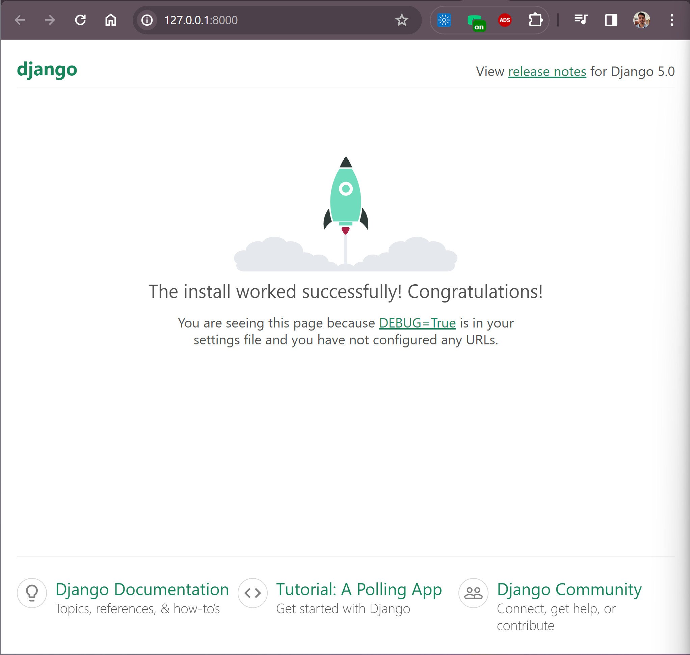

# Django Master

Destrinchando e planejando aula.

## Ambientação e instalação

<strong> Instruções - windows</strong> <br>

Instalar o python em <https://www.python.org/>
Instalando pelo site, a ferramenta ja com vem o PIP e o VENV instalados nativamente.
podemos sempre verificar a versão atual do PIP com:

```pip --version```

e atualizar o PIP com:

```python.exe -m pip install --upgrade pip```

Observação: No Linux, deve-se instalar essas ferramentas

Voltando ao Windows...
Para criar o ambiente de desenvolvimento VENV para que não corramos o risco de alterar o python nativo instalado no windows, devemos...

1. criar o ambiente de densenvolvimento.
Para criar devemos ir (de preferencia) na raiz da pasta onde concentraremos nosso projeto.
código:

```python -m venv venv```

note que o último venv é referente ao nome que damos ao ambiente de desenvolvimento..fica livre a escolha do mesmo porém se adota venv como padrão.

2. Ativando o ambiente de densenvolvimento no windows.

```venv/scripts/activate```

2. Ativando o ambiente de densenvolvimento no Linux.

```source venv/bin/activate```

Ao ser ativado o terminal ficaria com um (nome verde) e passara a usar tds as dependencias dentro do python do ambiente recem criado

Podemos inclusive verificar a versao do PIP instalado neste python do venv e atualiza-lo.

```pip --version```

```python.exe -m pip install --upgrade pip```

### Política de execução Powershell [Windows]

Um ponto importante para quem esta rodando no Windows, devemos alterar uma configuração do PowerShell para rodar ele de boa no VSCode.
Usando o PowerShell temos maior controle sobre nosso PC e por padrão ele vem com algumas restrições de execução de scripts no PC, enfim, temos que corrigir isso. E sera da seguinte forma.
Devemos abrir no PowerShell com privilégios de administrador e rodar algum desses comando a seguir. <strong> RECOMENDO O 1 </strong> pois é geral mas vai depender da maneira como voce usa o PC onde esta executando este curso.

1. Alteração de política global:

```Set-ExecutionPolicy Unrestricted```

ou

2. Alteração de política por sessão:

```Set-ExecutionPolicy -ExecutionPolicy RemoteSigned -Scope CurrentUser```

A ideia é sempre que pegar um windows zerado logo executar esse comando para evitar dores de cabeça futuras.

# Começando pelo COMEÇO

Conhecimento básicos que devemos saber para iniciar no python
ver os notebooks

Começando com Django.

1. Criando e Conhecendo o seu Projeto

Mas qual é a ideia do projeto? Guardar registro de carros! Marca, modelo, ano e etc. 
<br> 
É uma app simples e funcional!

1. Crie uma pasta com o nome do app;

<br>
2. Crie um ambiente virtual venv dentro da pasta;


<br>
3. Ative o ambiente criado


<br>
Para verificar se ativou... no seu terminal irá aparecer a imagem a seguir


<br>

4. No terminal `pip install django`
Para verificar se o django foi instalado na versão correta rode o  `django-admin --version` no terminal
O retorno deve ser a versão instalada.
<br>

Até o momento temos:
* ambiente virtual criado e ativado
* django instalado e verificado

5. Quando instalamos o Django, ele cria alguns comando no CLI do django-admin para que possamos gerenciar nosso projeto

O primeiro comando que podemos utilizar é... `django-admin startproject` + nome do app + .
<br>

O ponto é para indicar ao django em qual diretório vc quer q ele crie os arquivos iniciais do projeto e como já estamos na pasta carros pelo terminal.. o ponto indica ela.

Então.. fica assim "django inicie o projeto de nome app na pasta raiz em que estou localizado"
Por que app? Ela é o coração do projeto..se eu chamasse de carros seria ./carros/carros/ arquivos do django então poderia ficar confuso. Por questão de organização escolhi esse nome.
<br>

Ficando `django-admin startproject app .`
<br>

6. Perceberam que ao dar o startproject o djando criou o arquivo `manage.py`?

Este arquivo chama uma série de comandos internos para rodar nossa aplicação django. 

O próximo comando no terminal é o `python manage.py runserver`


No terminal haverá a seguinte mensagem


E ao clicarmos no `http://127.0.0.1:8000/`
Seremos direcionados ao navegador e se tudo deu certo e o servidor startou..



A imagem acima é como se fosse um Hello world do django rs

7. Dando uma pincelada sobre TESTES bem rapidamente.
É de conhecimento comum que códigos que possuem testes são melhores vistos.

Mas como testar no django? Simples, podemos botar para rodar nossos testes da seguinte forma, no terminal:
`.\manage.py test`


Note que não retornou nenhum resultado pois não temos ainda nada configurado a respeito, porém foi feita a rotina de execução do próprio django.

Temos uma outra forma mais visual de ver isso também pelo terminal:
`python manage.py test`


8. Django apps
Durante o andamento do nosso projeto carros teremos vários apps (não considera a app criada inicialmente pois ela é a pasta principal de configurações.. o coração do nosso projeto) e isso é uma grande vantagem do django. 


Queremos fazer um gerenciamento de carros...e vamos criar uma aplicação dentro do nosso projeto e dentro dele (o verde por exemplo) haverá toda a lógica de registro de carros, podemos também ter um app sobre vendedores de carros (amarelo por exemplo). Poderiamos colocar toda a nossa app dentro de um único projeto tudo misturado... poderiamos sim mas não seria uma prática. O ideial é todo app ter sua separação lógica e organizada e isso facilita muito na manutenção do código em sí.
<br>

9. Criaremos agora nossa primeira app do django que sera nossa princial para gerenciar o cadastro de carros.
<br>

No terminal: `python manage.py startapp cars`

Note que uma nova pasta agora aparece na raiz na pasta carros


<strong>Informação importante</strong>

Criamos a pasta app cars porém ainda não estamos dizendo ao django para a usarmos. 
Devemos resolver isso no coração do nosso projeto... no app> arquivo <strong> settings.py</strong> que é nosso arquivo de configuração geral de projeto


Por padrão, temos de fábrica os seguintes itens já pré configurados


Devemos adicionar o app cars no settings.py nos INSTALLED_APPS


Feito isso, agora podemos explorar melhor nossos arquivos da nossa nova app.

Um arquivo muito importante é o models.py
Em toda app que a gente criar nos vamos ter q utilizar esse arquivo pois é nele que iremos escrever nossos models ou modelos, ou fazendo uma analogia melhor... as nossas tabelas do banco de dados.

É neste models.py que sera dito que a tabela carros terá o campo nome do carro, o campo ano do carro, o campo modelo do carro e que esses campos serão charfields de 100 caracteres ou que esses campos serão do tipo inteiro.

Os models do django tem camada própria e é importante dominar isso.


Teremos mais a frente uma app vendedores de carro e nesta app também haverá um arquivo models.py e por ai vai.

Temos também outro arquivo importante que é o views.py


Neste arquivo iremos escrever todas as views do nosso app cars.

Basicamente a view tem a lógica que precisaremos aplicar a nossa aplicação como por exemplo quando um usuário bater no link /carros e quiser listar os carros na página de carros. Será lógica de trazer e renderizar que esta página estará nas views.py

Temos também o arquivo admin.py


O arquivo admin tem relaçao com a admin do django. É uma tela de adminstração de conteúdo. Não são vistas pelos clientes finais de quem acessa o site, são vistas apenas pelos administradores do sistema. Através do admin conseguimos um CRUD completo de cars.


r
Subindo o servidor e através do /admin temos a tela admin.
V


O usuário e senha veremos mais para frente.

Contudo, de onde vem esse /admin?

Láaa no nosso core do projeto (app), temos o urls.py e dentro desse arquivo temos permitida a rendização do admin/


10. Entendendo Apps e Camadas no Django

Vamos falar um pouco sobre as camadas do django.


Temos o nosso usuário usando o navegador, usando o nosso sistema que esta rodando no servidor

Ele vai bater em alguma URL, então a nossa primeira camada é o URLS. É o roteamente de urls que o django faz essa interpretação.
Portando, por exemplo, quando usuário bate na url /admin ele vai no arquivo de urls.py do core do projeto (app) e olha o tipo de urls acessada e qual o direcionamento que deve acontecer.


Logo, podemos entender que esse urls leva para uma página de admin que é uma view.

Dentro do arquivo de views no core do projeto (app) estará o comando para retornar cars. Ela fará um trabalho de meio campo de trazer dados e retornar para o usuário.

E como a views faria isso? Conversado com os Models, que é outra camada.

A views vai buscar nos modals informações como por exemplo nome do carro, ano do carro e tudo mais. Nesse processo os models conversam com os bancos de dados e os bancos de dados retornam os dados para os models e os moderls por sua vez disponibilizam para as views. A view por sua vez devolve para o navegador do usuário a página de carros com os dados que ele solicitou.

Pode parecer confuso agora porém veremos camada a camada mais a frente.

11. Comando makemigrations


